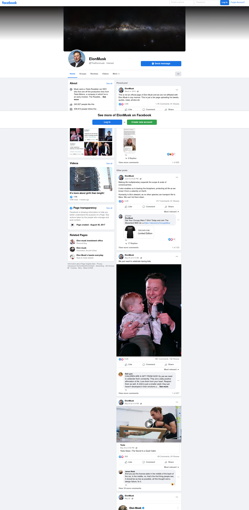

# Facebook Page Imitation

## Imitation of the famous FB home page and a FB Page inside facebook - DCI Group project (June 23.2022)

### Part 1:

Do an imitation of the facebook landing page.
Make it look good on all screen sizes.

#### Mockups:

- Desktop:
  

- Tablet:
  

- Mobile.

### Part 2:

Do an imitation of any FB page design in 2022 mainly using CSS.
Make it look good on all screen sizes.

#### Mockup images:

- Desktop design:
  

- Tablet Design:
  

- Mobile Design:
  

#### Live examples:

Target example: https://www.facebook.com/TheElonmusk/
Mockup Example 2: https://www.facebook.com/TomandJerry
Mockup Example 3: https://www.facebook.com/officialpinkpanther
Mockup Example 4: https://www.facebook.com/GhibliUSA/
Mockup Example 5: https://www.facebook.com/AtlusWest/

#### Implementation Sketch Plan:

 

#### FB Styles to use in the project

